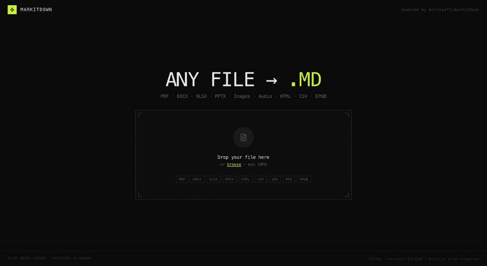

# MarkItDown Web App

[](./LICENSE)

Convert **any file** to clean Markdown in your browser.  
Powered by [microsoft/markitdown](https://github.com/microsoft/markitdown).



## Supported formats

| Category | Formats |
|----------|---------|
| Documents | PDF, DOCX, DOC, PPTX, XLSX, XLS |
| Web | HTML, HTM, XML |
| Text | TXT, MD, CSV, JSON |
| Images | JPG, PNG, GIF, WEBP (OCR via markitdown) |
| Audio | MP3, WAV (transcription via markitdown) |
| Archives | ZIP, EPUB |

## Tech stack

| Layer | Technologies |
|-------|----------------|
| **Framework** | [Next.js 14](https://nextjs.org) (App Router), React 18, TypeScript 5 |
| **Styling** | Tailwind CSS 3 (custom theme: `ink`, `paper`, `acid`, `rust`) |
| **UI** | Framer Motion, react-dropzone, lucide-react |
| **Markdown preview** | react-markdown, remark-gfm |
| **Observability** | [@vercel/speed-insights](https://vercel.com/docs/speed-insights) (`app/layout.tsx`) |
| **Conversion** | Python `markitdown[all]` (see `requirements.txt`) |
| **Deploy** | Vercel (Next.js + Python serverless) |

## Project structure

```text
markitdown-app/
├── app/
│   ├── layout.tsx              # Root layout + SpeedInsights
│   ├── page.tsx                # Home → ConverterApp
│   ├── globals.css
│   └── api/convert/route.ts    # Local dev API only (excluded on Vercel)
├── components/
│   ├── ConverterApp.tsx        # Main UI (dropzone, states, tabs)
│   ├── FileIcon.tsx
│   ├── MarkdownPreview.tsx
│   └── StatsBar.tsx
├── api/
│   └── convert.py              # Vercel Python serverless (production)
├── scripts/
│   └── convert_cli.py          # CLI used by route.ts in local dev
├── docs/screenshots/             # README images (e.g. app-home.png)
├── requirements.txt
├── vercel.json                   # Python function limits (timeout, memory)
└── package.json
```

## Architecture

The browser always calls `POST /api/convert` with `multipart/form-data` (`file` field). The backend path depends on the environment:

### Local (`npm run dev`)

```text
Browser
  → POST /api/convert
  → app/api/convert/route.ts (Node)
  → spawn .venv/bin/python3 scripts/convert_cli.py
  → markitdown.convert(temp file)
  → JSON response
```

### Vercel (Preview & Production)

```text
Browser
  → POST /api/convert
  → api/convert.py (Python serverless, 60s / 1024MB)
  → markitdown.convert(temp file)
  → JSON response
```

`app/api/convert/route.ts` is listed in `.vercelignore` so it is **not** deployed. Production always uses `api/convert.py`.

Files are **never persisted** — uploaded bytes are written to a temp file, converted, then deleted.

### API response

**Success (200):**

```json
{
  "markdown": "# Title\n...",
  "filename": "document.md",
  "original_filename": "document.pdf",
  "char_count": 1234
}
```

**Error (4xx/5xx):**

```json
{
  "error": "Human-readable message"
}
```

## Local development

### Prerequisites

- **Node.js** 18+
- **Python** 3.11+ (3.12 on Vercel Python runtime)
- **npm** (project uses `packageManager` in `package.json`)

### First-time setup

```bash
cd markitdown-app

# Node dependencies
npm install

# Python (venv recommended)
python3 -m venv .venv
source .venv/bin/activate   # Windows: .venv\Scripts\activate
pip install -r requirements.txt
```

### Run (recommended)

```bash
source .venv/bin/activate
npm run dev
```

Open the URL shown in the terminal (usually **http://localhost:3000**). Upload a file to test conversion.

### Other scripts

| Script | Purpose |
|--------|---------|
| `npm run dev` | Next.js dev server + local `/api/convert` |
| `npm run dev:vercel` | Vercel CLI dev (mirrors production routing) |
| `npm run build` | Production build (run before deploy) |
| `npm run start` | Serve production build locally |
| `npm run lint` | ESLint |

### Optional: Vercel CLI locally

```bash
npm i -g vercel
vercel link
vercel dev
```

Use this to test the Python serverless function exactly as on Vercel. For day-to-day development, `npm run dev` is simpler.

### Pull env vars from Vercel

```bash
vercel link
vercel env pull
```

Creates `.env.local` with variables configured in the Vercel dashboard.

### Test the API

```bash
curl -s -X POST http://localhost:3000/api/convert \
  -F "file=@/path/to/your/file.pdf" | jq .
```

## Deploy to Vercel

### Dashboard settings (important)

In **Project → Settings → Build & Development**:

| Setting | Value |
|---------|--------|
| **Framework Preset** | Next.js |
| **Build Command** | `npm run build` (or default) |
| **Output Directory** | *(leave empty — do not use `public`)* |
| **Install Command** | `npm install` (or default) |

Next.js outputs to `.next/`; Vercel handles this automatically. Setting Output Directory to `public` will break the deploy.

### Deploy via Git (recommended)

1. Push the repo to GitHub/GitLab/Bitbucket.
2. Import the project in [Vercel](https://vercel.com).
3. **Preview**: push to any branch that is not production, or open a PR → unique preview URL.
4. **Production**: merge to your production branch (usually `main`) or run `vercel --prod`.

See [Vercel environments](https://vercel.com/docs/deployments/environments).

### Deploy via CLI

```bash
vercel login
vercel          # preview deployment
vercel --prod   # production
```

### What Vercel deploys

- `package.json` → Next.js build
- `api/convert.py` → Python serverless function
- `requirements.txt` → installed in the Python runtime
- `vercel.json` → `maxDuration: 60`, `memory: 1024` for `api/convert.py`

### Environment variables

None required for basic conversion.

| Variable | Required | Description |
|----------|----------|-------------|
| `OPENAI_API_KEY` | No | Enables markitdown AI features (e.g. image description via GPT-4V) |

Set in **Project → Settings → Environment Variables** for Production / Preview / Development as needed.

### Speed Insights

1. Enable **Speed Insights** in the Vercel project dashboard.
2. The app already includes `<SpeedInsights />` in `app/layout.tsx`.
3. Deploy; metrics appear after real traffic. See [Speed Insights quickstart](https://vercel.com/docs/speed-insights/quickstart?framework=nextjs).

## Limits (Vercel Hobby)

| Limit | Value |
|-------|--------|
| Max file size | 50 MB (client + server) |
| Function timeout | 60 s (`vercel.json`) |
| Function memory | 1024 MB (`vercel.json`) |
| Monthly invocations | 100k (Hobby plan) |

Large PDFs or OCR/audio may hit the timeout.

## Troubleshooting

| Symptom | Likely cause | Fix |
|---------|----------------|-----|
| UI works, conversion fails locally | Python / venv | `source .venv/bin/activate` and `pip install -r requirements.txt` |
| `POST /api/convert` 404 | Wrong dev server or port | Use `npm run dev`; open the URL from the terminal |
| `markitdown not installed` | Missing pip deps | Install inside active venv |
| Vercel: “No Output Directory named public” | Wrong framework settings | Framework **Next.js**, Output Directory **empty** |
| Vercel: conversion fails, UI OK | Node route deployed instead of Python | Ensure `.vercelignore` excludes `app/api/convert/route.ts` |
| Multiple servers on 3000/3001/3002 | Stale processes | Stop other `npm run dev` / `vercel dev`; use one URL |

## License

This project is open source under the [MIT License](./LICENSE).

Third-party conversion is powered by [microsoft/markitdown](https://github.com/microsoft/markitdown) (see their repository for license terms).
